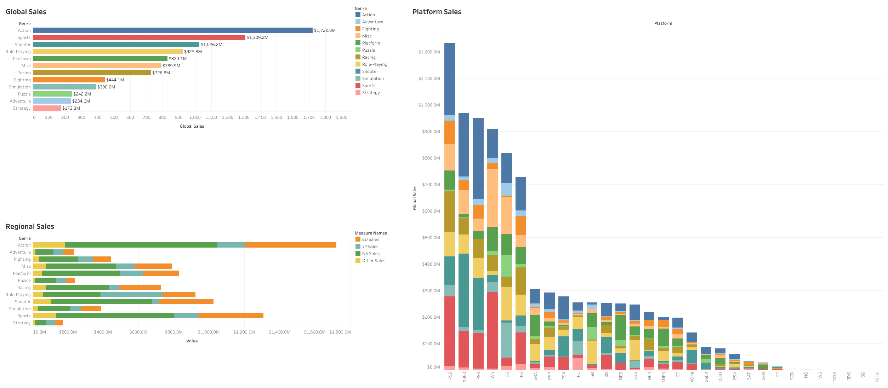
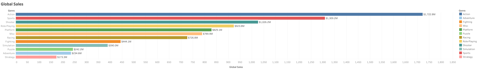
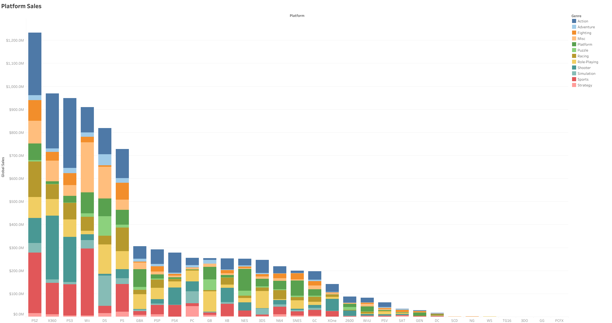
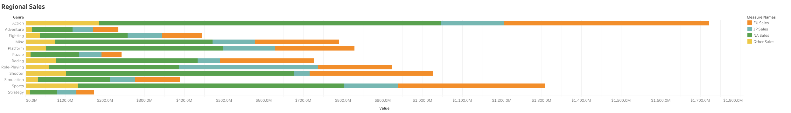

# 🎮 Global Video Game Sales: An Interactive Dashboard

This project features an interactive Tableau dashboard built to visualize historical video game sales data. The goal is to provide clear, actionable insights into sales trends across different genres, platforms, and regions.

**➡️ [View and Interact with the Live Dashboard on Tableau Public](https://public.tableau.com/views/vgsales_dashboard_17471669939140/LifetimeVideoGameSalesInsights)**

---

### Dashboard Overview

---

### About The Project

This dashboard was created to analyze a comprehensive dataset of over 16,000 video game titles. The data, sourced from Kaggle, was first cleaned and prepared using Python (Pandas) and SQL to ensure accuracy before being visualized in Tableau.

The primary objective was to identify key market trends and answer questions such as:
* Which video game genres are the most successful globally?
* How do sales compare across major regions like North America, Europe, and Japan?
* Which gaming platforms have historically dominated the market?

---

### Dashboard Highlights & Visuals

The dashboard is composed of several key worksheets that allow for easy exploration of the data:

#### Global Sales by Genre & Platform

#### Regional Sales Breakdown

---

### 🛠️ Tools & Technology

* **Data Cleaning:** Python (Pandas), SQL (Google BigQuery)
* **Data Visualization:** Tableau Desktop
* **Publishing:** Tableau Public

---

### 🧼 Data Cleaning Summary

To ensure the integrity of the analysis, the following data cleaning steps were performed:
- Removed rows with missing `Year` or `Publisher` data.
- Converted the `Year` data type to an integer for proper sorting and filtering.
- Filtered out anomalous entries with a `Year` greater than 2024.
